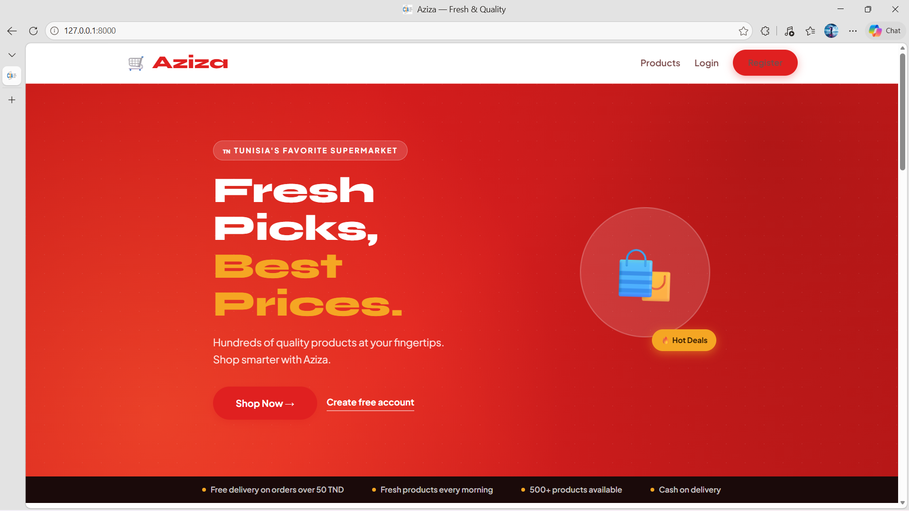
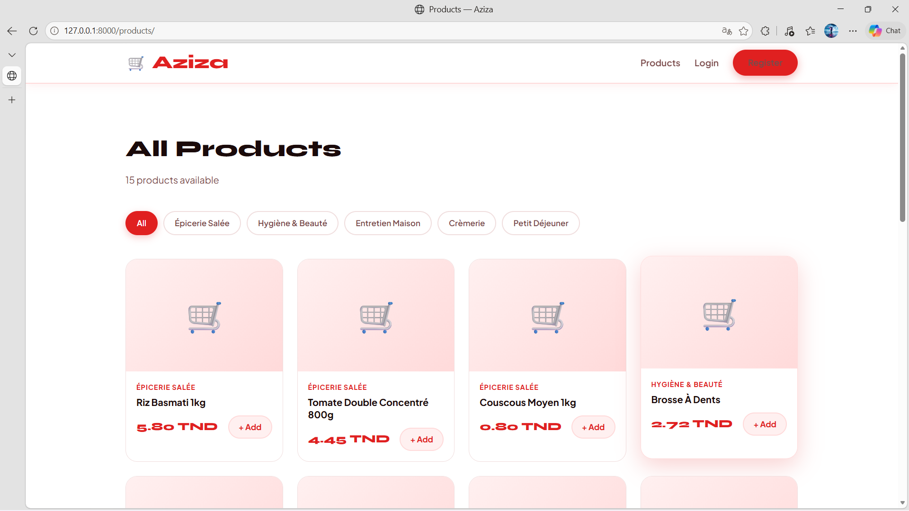
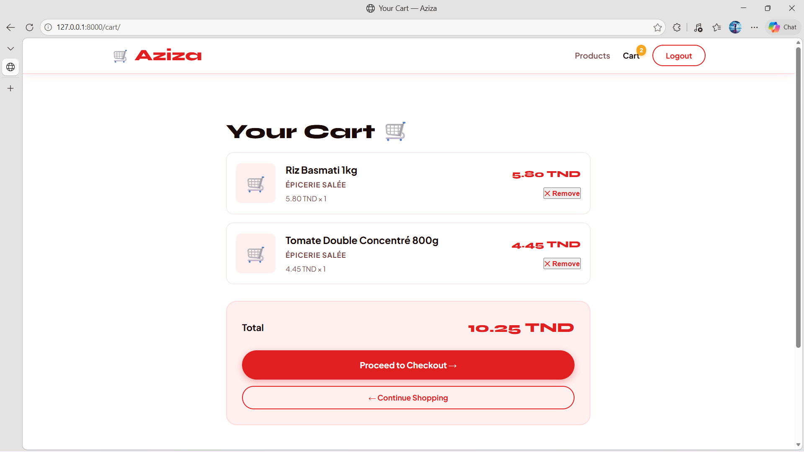
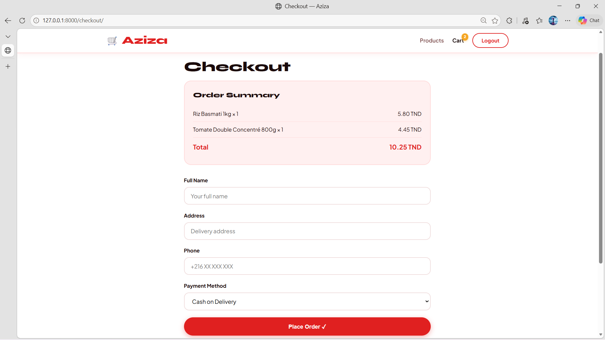

# Aziza E-Commerce Platform

A web-based e-commerce platform developed with Django and Python during a technical internship at Société AZIZA de Commerce de Détail.

The application provides a complete online shopping workflow, including product browsing, category filtering, shopping cart management, user authentication, checkout, and order placement.

## 📸 Screenshots

### Home Page



### Products



### Shopping Cart



### Checkout



## 🎯 Project Overview

This project was developed as part of a technical internship at **Société AZIZA de Commerce de Détail** from **July 15 to August 15, 2025**.

The main objective was to design and develop an online shopping platform while applying practical concepts in backend development, frontend development, database management, authentication, and web application security.

## ✨ Features

- User registration and authentication
- Product catalog
- Product browsing
- Category filtering
- Shopping cart management
- Checkout
- Order placement
- Order management
- Django administration
- Database integration
- Authentication and access control
- CSRF protection
- Responsive web interface

## 🛠️ Technologies

- **Python**
- **Django**
- **HTML5**
- **CSS3**
- **SQLite**
- **python-dotenv**
- **Git**

## 🏗️ Architecture

The application follows Django's **MVT (Model-View-Template)** architecture.

```text
aziza-ecommerce-django/
│
├── aziza/                  # Project configuration
│   ├── settings.py
│   ├── urls.py
│   ├── asgi.py
│   └── wsgi.py
│
├── store/                  # E-commerce functionality
│   ├── models.py
│   ├── views.py
│   ├── urls.py
│   └── admin.py
│
├── users/                  # User authentication
│   ├── forms.py
│   ├── views.py
│   ├── urls.py
│   └── models.py
│
├── templates/              # HTML templates
│   ├── store/
│   └── users/
│
├── static/                 # CSS and static files
│   └── css/
│
├── manage.py               # Django management script
├── requirements.txt        # Python dependencies
└── .gitignore              # Git ignored files